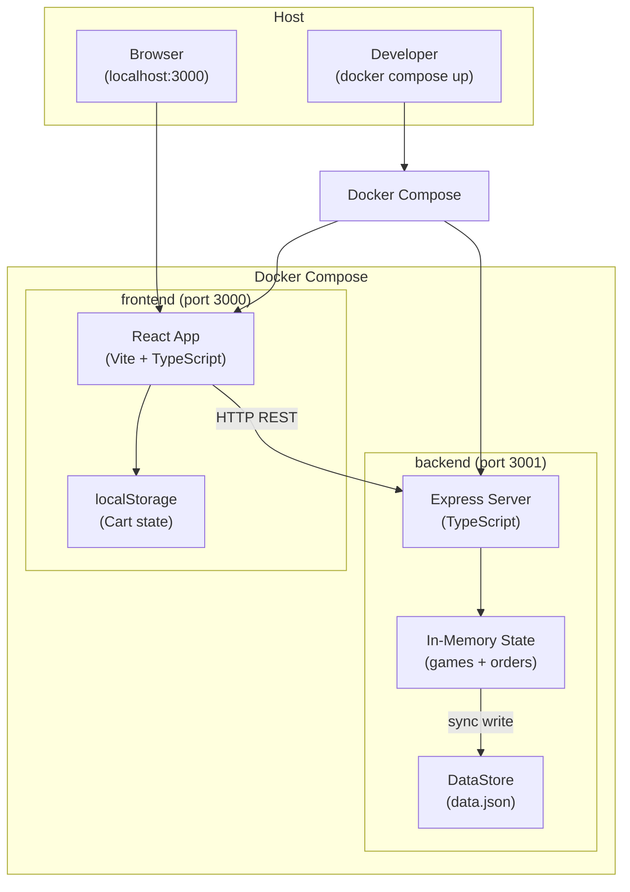

# Design Document: Videogame Store

## Overview

Videogame Store es una aplicación web full stack de e-commerce para la venta de videojuegos. El sistema se compone de un frontend React/TypeScript que consume una API REST Express/TypeScript, con persistencia en un archivo JSON y orquestación mediante Docker Compose.

El flujo principal es: el usuario explora el catálogo → agrega juegos al carrito (persistido en localStorage) → completa el checkout → la API valida stock, crea la orden y actualiza el DataStore.

### Decisiones de diseño clave

- **DataStore como archivo JSON**: Elimina la necesidad de una base de datos relacional para este scope. La API mantiene el estado en memoria y escribe síncronamente al archivo en cada mutación.
- **Cart en localStorage**: El carrito es estado del cliente, no del servidor. Esto simplifica la arquitectura y evita sesiones de servidor.
- **TypeScript en ambos lados**: Tipos compartidos entre frontend y backend para consistencia de contratos.
- **Docker Compose**: Un único comando levanta todo el entorno de desarrollo con hot-reload.

---

## Architecture



### Flujo de datos

1. Al iniciar, el backend lee `data.json` y carga el estado en memoria.
2. El frontend obtiene el catálogo vía `GET /api/games` y renderiza la lista.
3. El usuario gestiona el carrito en el cliente (localStorage).
4. Al hacer checkout, el frontend envía `POST /api/orders` con los items y datos del comprador.
5. El backend valida, decrementa stock, persiste la orden y responde con el ID de orden.
6. El frontend limpia el carrito y muestra la confirmación.

---

## Components and Interfaces

### Frontend Components

```
src/
├── components/
│   ├── GameCard.tsx          # Tarjeta de juego en el catálogo
│   ├── GameDetail.tsx        # Vista de detalle de un juego
│   ├── GameCatalog.tsx       # Grid del catálogo con filtros y búsqueda
│   ├── CartIcon.tsx          # Ícono con badge de cantidad
│   ├── CartDrawer.tsx        # Panel lateral del carrito
│   ├── CartItem.tsx          # Ítem individual en el carrito
│   └── CheckoutForm.tsx      # Formulario de checkout
├── pages/
│   ├── HomePage.tsx          # Página principal con catálogo
│   ├── GameDetailPage.tsx    # Página de detalle de juego
│   └── OrderConfirmationPage.tsx  # Pantalla de confirmación
├── hooks/
│   ├── useCart.ts            # Hook para gestión del carrito
│   ├── useGames.ts           # Hook para fetch del catálogo
│   └── useCheckout.ts        # Hook para proceso de checkout
├── services/
│   └── api.ts                # Cliente HTTP para la API REST
├── store/
│   └── cartStore.ts          # Estado global del carrito (Context o Zustand)
└── types/
    └── index.ts              # Tipos compartidos (Game, CartItem, Order)
```

### Backend Structure

```
src/
├── routes/
│   ├── games.ts              # GET /api/games, GET /api/games/:id
│   └── orders.ts             # POST /api/orders, GET /api/orders/:id
├── middleware/
│   ├── cors.ts               # Configuración CORS
│   └── errorHandler.ts       # Manejo centralizado de errores
├── services/
│   ├── dataStore.ts          # Lectura/escritura del archivo JSON
│   └── orderService.ts       # Lógica de negocio de órdenes
├── validators/
│   └── orderValidator.ts     # Validación de campos y email
├── types/
│   └── index.ts              # Tipos (Game, Order, CartItem, BuyerInfo)
└── server.ts                 # Entry point Express
```

### API Contract

| Method | Endpoint | Request Body | Response |
|--------|----------|-------------|----------|
| GET | `/api/games` | — | `200 Game[]` |
| GET | `/api/games/:id` | — | `200 Game` / `404` |
| POST | `/api/orders` | `CreateOrderRequest` | `201 OrderResponse` / `400` / `409` / `500` |
| GET | `/api/orders/:id` | — | `200 Order` / `404` |

```typescript
// POST /api/orders - Request
interface CreateOrderRequest {
  buyer: {
    name: string;
    email: string;
    address: string;
  };
  items: Array<{
    gameId: string;
    quantity: number;
  }>;
}

// POST /api/orders - Response 201
interface OrderResponse {
  orderId: string;
  total: number;
  createdAt: string;
}
```

---

## Data Models

### Game

```typescript
interface Game {
  id: string;           // UUID v4
  title: string;
  description: string;
  price: number;        // en USD, ej: 59.99
  genre: string;        // ej: "Action", "RPG", "Sports"
  platform: string;     // ej: "PC", "PS5", "Xbox", "Nintendo Switch"
  imageUrl: string;     // URL de imagen del juego
  stock: number;        // entero >= 0
}
```

### CartItem (cliente)

```typescript
interface CartItem {
  game: Game;
  quantity: number;     // entero >= 1
}
```

### Order

```typescript
interface Order {
  id: string;           // UUID v4
  buyer: {
    name: string;
    email: string;
    address: string;
  };
  items: Array<{
    gameId: string;
    gameTitle: string;  // snapshot del título al momento de la compra
    quantity: number;
    unitPrice: number;  // snapshot del precio al momento de la compra
  }>;
  total: number;        // suma de (unitPrice × quantity)
  createdAt: string;    // ISO 8601
}
```

### DataStore (data.json)

```typescript
interface DataStore {
  games: Game[];
  orders: Order[];
}
```

### Ejemplo de data.json inicial

```json
{
  "games": [
    {
      "id": "a1b2c3d4-...",
      "title": "The Legend of Zelda: Breath of the Wild",
      "description": "Un mundo abierto épico...",
      "price": 59.99,
      "genre": "Adventure",
      "platform": "Nintendo Switch",
      "imageUrl": "https://...",
      "stock": 15
    }
    // ... 9 juegos más
  ],
  "orders": []
}
```

---

## Correctness Properties

*A property is a characteristic or behavior that should hold true across all valid executions of a system — essentially, a formal statement about what the system should do. Properties serve as the bridge between human-readable specifications and machine-verifiable correctness guarantees.*


### Property 1: Filtrado del catálogo preserva solo juegos que cumplen el criterio

*Para cualquier* lista de juegos y cualquier criterio de filtrado (género, plataforma, o texto de búsqueda), todos los juegos en el resultado deben cumplir el criterio aplicado, y ningún juego que cumpla el criterio debe ser excluido del resultado.

**Validates: Requirements 1.3, 1.4**

### Property 2: Juego con stock cero muestra estado deshabilitado

*Para cualquier* juego con `stock === 0`, el componente de visualización debe mostrar el indicador "Sin stock" y el botón de agregar al carrito debe estar deshabilitado. *Para cualquier* juego con `stock > 0`, el botón debe estar habilitado.

**Validates: Requirements 1.6**

### Property 3: Vista de detalle contiene todos los atributos del juego

*Para cualquier* objeto Game válido, el componente de detalle renderizado debe contener el título, descripción, precio, género, plataforma, URL de imagen y stock del juego.

**Validates: Requirements 1.5**

### Property 4: addToCart incrementa la cantidad correctamente

*Para cualquier* estado del carrito y cualquier juego con stock disponible, después de ejecutar addToCart la cantidad del juego en el carrito debe ser exactamente la cantidad anterior más 1 (o 1 si el juego no estaba en el carrito), sin modificar los demás ítems.

**Validates: Requirements 2.1**

### Property 5: El total del carrito es la suma exacta de precio por cantidad

*Para cualquier* estado del carrito con N ítems, el total calculado debe ser exactamente igual a la suma de `(item.game.price × item.quantity)` para cada ítem en el carrito.

**Validates: Requirements 2.7, 2.2**

### Property 6: La cantidad en el carrito no puede superar el stock disponible

*Para cualquier* CartItem y cualquier intento de incrementar su cantidad, la cantidad resultante nunca debe superar el `stock` del juego asociado. Si la cantidad actual ya es igual al stock, el incremento debe ser rechazado.

**Validates: Requirements 2.3, 2.4**

### Property 7: removeFromCart elimina el ítem y recalcula el total

*Para cualquier* carrito con al menos un ítem, después de eliminar un ítem específico, ese ítem no debe aparecer en el carrito resultante, y el total debe ser recalculado correctamente sin incluir ese ítem.

**Validates: Requirements 2.5**

### Property 8: clearCart produce un carrito vacío con total cero

*Para cualquier* estado del carrito (incluyendo carritos con múltiples ítems), después de ejecutar clearCart el carrito debe tener cero ítems y el total debe ser 0.

**Validates: Requirements 2.6**

### Property 9: Round-trip de persistencia del carrito en localStorage

*Para cualquier* estado del carrito, serializar el carrito a localStorage y luego deserializarlo debe producir un carrito idéntico al original (mismos ítems, mismas cantidades, mismo total).

**Validates: Requirements 2.8**

### Property 10: La validación de Order rechaza requests con campos faltantes

*Para cualquier* combinación de campos faltantes en una solicitud de Order (nombre, email, dirección, o items vacíos), la API debe retornar HTTP 400 con un mensaje descriptivo que identifique el campo faltante.

**Validates: Requirements 3.3, 3.4**

### Property 11: La validación de stock rechaza órdenes con cantidad insuficiente

*Para cualquier* Order donde la cantidad solicitada de algún Game supera el stock disponible en el DataStore, la API debe retornar HTTP 409 identificando el Game con stock insuficiente, sin modificar el DataStore.

**Validates: Requirements 3.5, 3.6**

### Property 12: El procesamiento de Order decrementa el stock exactamente

*Para cualquier* Order válida procesada exitosamente, el stock de cada Game en el DataStore debe decrementarse exactamente en la cantidad pedida en la Order, y el stock de los Games no incluidos en la Order no debe cambiar.

**Validates: Requirements 3.7**

### Property 13: La respuesta de Order exitosa contiene orderId y total correcto

*Para cualquier* Order válida procesada exitosamente, la respuesta HTTP 201 debe contener un `orderId` (string no vacío) y un `total` que sea exactamente igual a la suma de `(unitPrice × quantity)` de cada ítem en la Order.

**Validates: Requirements 3.8**

### Property 14: Round-trip de persistencia del DataStore

*Para cualquier* operación de escritura en el DataStore (crear Order, actualizar stock), después de que la operación completa, leer el archivo JSON del DataStore debe producir un estado idéntico al estado en memoria del servidor.

**Validates: Requirements 4.3**

### Property 15: Todas las respuestas de la API tienen Content-Type application/json

*Para cualquier* endpoint de la API y cualquier request válida, la respuesta debe incluir el header `Content-Type: application/json`, independientemente del código de estado HTTP retornado.

**Validates: Requirements 5.2**

### Property 16: Solicitud de Game inexistente retorna HTTP 404

*Para cualquier* identificador de Game que no exista en el DataStore, la solicitud `GET /api/games/:id` debe retornar HTTP 404 con un mensaje de error descriptivo.

**Validates: Requirements 5.4**

### Property 17: La validación de email rechaza formatos inválidos

*Para cualquier* string que no sea un email con formato válido (user@domain.tld), la API debe rechazar la solicitud de Order con HTTP 400 e identificar el campo `email` como inválido.

**Validates: Requirements 5.5, 5.6**

---

## Error Handling

### Estrategia general

El backend usa un middleware centralizado de manejo de errores. Todos los errores se capturan y se transforman en respuestas JSON con el formato:

```json
{
  "error": "Mensaje descriptivo del error",
  "field": "campo_afectado"  // opcional, para errores de validación
}
```

### Tabla de errores por endpoint

| Situación | Código HTTP | Mensaje |
|-----------|-------------|---------|
| Game no encontrado | 404 | `"Game not found: {id}"` |
| Order no encontrada | 404 | `"Order not found: {id}"` |
| Campo requerido faltante | 400 | `"Missing required field: {field}"` |
| Cart vacío en checkout | 400 | `"Order must contain at least one item"` |
| Email inválido | 400 | `"Invalid email format: {email}"` |
| Stock insuficiente | 409 | `"Insufficient stock for game: {title}. Available: {stock}"` |
| Error de escritura en DataStore | 500 | `"Internal server error: failed to persist data"` |

### Manejo de errores en el frontend

- Errores de red (sin conexión): mostrar banner de error con opción de reintentar
- Error 400 en checkout: mostrar mensajes de validación en los campos del formulario
- Error 409 (stock insuficiente): mostrar alerta con el juego afectado y actualizar el catálogo
- Error 500: mostrar mensaje genérico de error del servidor

### Reversión de estado en el backend

Cuando ocurre un error al escribir en el DataStore (Requirement 4.4):
1. La operación de escritura falla
2. El estado en memoria se revierte al snapshot previo a la operación
3. Se retorna HTTP 500
4. El archivo JSON permanece en su estado anterior (no se corrompe)

---

## Testing Strategy

### Enfoque dual: Unit Tests + Property-Based Tests

La estrategia combina tests de ejemplo para casos específicos con property-based tests para verificar propiedades universales.

### Librería de Property-Based Testing

- **Backend (TypeScript)**: [fast-check](https://github.com/dubzzz/fast-check)
- **Frontend (TypeScript/React)**: [fast-check](https://github.com/dubzzz/fast-check) con React Testing Library

### Configuración de Property Tests

- Mínimo **100 iteraciones** por property test
- Cada test referencia la propiedad del documento de diseño con el tag:
  `// Feature: videogame-store, Property {N}: {descripción}`

### Tests por capa

#### Backend — Unit/Property Tests

| Test | Tipo | Propiedad |
|------|------|-----------|
| Filtrado de catálogo por género/plataforma/texto | PROPERTY | Property 1 |
| Validación de campos requeridos en Order | PROPERTY | Property 10 |
| Validación de stock insuficiente | PROPERTY | Property 11 |
| Decremento de stock tras Order | PROPERTY | Property 12 |
| Total de Order calculado correctamente | PROPERTY | Property 13 |
| Round-trip de persistencia del DataStore | PROPERTY | Property 14 |
| Content-Type en todas las respuestas | PROPERTY | Property 15 |
| 404 para Game inexistente | PROPERTY | Property 16 |
| Validación de email inválido | PROPERTY | Property 17 |
| Error 500 con reversión de estado | EXAMPLE | Req 4.4 |
| Endpoints disponibles y responden | SMOKE | Req 5.1 |

#### Frontend — Unit/Property Tests

| Test | Tipo | Propiedad |
|------|------|-----------|
| addToCart incrementa cantidad | PROPERTY | Property 4 |
| Total del carrito es correcto | PROPERTY | Property 5 |
| Límite de stock en carrito | PROPERTY | Property 6 |
| removeFromCart elimina ítem | PROPERTY | Property 7 |
| clearCart vacía el carrito | PROPERTY | Property 8 |
| Round-trip localStorage | PROPERTY | Property 9 |
| Juego sin stock deshabilitado | PROPERTY | Property 2 |
| Vista de detalle muestra atributos | PROPERTY | Property 3 |
| Formulario de checkout tiene campos requeridos | EXAMPLE | Req 3.1 |
| Checkout envía POST /api/orders | EXAMPLE | Req 3.2 |
| Confirmación vacía el carrito | EXAMPLE | Req 3.9 |

#### Integration Tests

| Test | Tipo |
|------|------|
| GET /api/games retorna todos los juegos | INTEGRATION |
| DataStore se carga en memoria al iniciar | INTEGRATION |
| Headers CORS presentes en respuestas | SMOKE |
| DataStore inicial tiene ≥10 juegos | SMOKE |

### Estructura de archivos de test

```
backend/
└── src/
    └── __tests__/
        ├── unit/
        │   ├── orderValidator.test.ts
        │   ├── orderService.test.ts
        │   └── dataStore.test.ts
        └── integration/
            ├── games.test.ts
            └── orders.test.ts

frontend/
└── src/
    └── __tests__/
        ├── hooks/
        │   ├── useCart.test.ts
        │   └── useCheckout.test.ts
        └── components/
            ├── GameCard.test.tsx
            ├── GameCatalog.test.tsx
            └── CheckoutForm.test.tsx
```
